# TestThinker
## 功能
测试bugly的Thinker热更新
## 简介
Bugly热更新是腾讯推出的热更新框架，热更新是指无需到应用市场重新下载安装app，只需要在app内下载补丁包即可实现app的更新，主要用于app的bug修复或者少量改动。

大家在使用app（特别是游戏app比较常见）的时候应该都有过类似经历：打开app时，一个弹框显示：有新的更新包，点击下载，只需要下载几百KB或几兆的补丁包，app就实现了更新，这就是使用的热更新技术。

Bugly热更新官方接入文档：https://bugly.qq.com/docs/user-guide/instruction-manual-android-hotfix/?v=20180709165613

## 一、添加插件依赖
工程根目录下“build.gradle”文件中添加：
<pre><code>
buildscript {
    repositories {
        jcenter()
    }
    dependencies {
        // tinkersupport插件, 其中lastest.release指拉取最新版本，也可以指定明确版本号，例如1.0.4
        classpath "com.tencent.bugly:tinker-support:1.1.5"
    }
}
</code></pre>
## 二、gradle配置
<pre><code>
android {
       defaultConfig {
        ndk {
            abiFilters 'armeabi'
        }
        signingConfigs {
            release {
                storeFile file(jks密钥库路径)
                storePassword 密钥库密码
                keyAlias 密钥名
                keyPassword 密钥密码
            }
        }
        buildTypes {
            release {
                //应用签名信息
                signingConfig signingConfigs.release
                minifyEnabled false
                proguardFiles getDefaultProguardFile('proguard-android.txt'), 'proguard-rules.pro'
            }
        }
       }
     }
dependencies {
    implementation 'com.android.support:design:27.1.1'
    implementation "com.android.support:multidex:1.0.1" // 多dex配置
    //注释掉原有bugly的仓库
    //compile 'com.tencent.bugly:crashreport:latest.release'//其中latest.release指代最新版本号，也可以指定明确的版本号，例如1.3.4
   implementation 'com.tencent.bugly:crashreport_upgrade:1.3.6'
   // 指定tinker依赖版本（注：应用升级1.3.5版本起，不再内置tinker）
   implementation 'com.tencent.tinker:tinker-android-lib:1.9.9'
   implementation 'com.tencent.bugly:nativecrashreport:latest.release' //其中latest.release指代最新版本号，也可以指定明确的版本号，例如2.2.0
 
   // 注意： 升级SDK已经集成crash上报功能，已经集成Bugly的用户需要注释掉原来Bugly的jcenter库； 已经配置过符号表的Bugly用户保留原有符号表配置； Bugly            SDK（2.1.5及以上版本）已经将Java Crash和Native Crash捕获功能分开，如果想使用NDK库，需要配置：
   compile  'com.tencent.bugly:nativecrashreport:latest.release'
 
 
}
</code></pre>
## 三、新建tinker-support.gradle
  在app module下新建tinker-support.gradle，内容如下：
<pre><code>
apply plugin: 'com.tencent.bugly.tinker-support'
 
def bakPath = file("${buildDir}/bakApk/")
 
/**
 * 此处填写每次构建生成的基准包目录
 */
def baseApkDir = "app-0409-14-09-52"
 
/**
 * 对于插件各参数的详细解析请参考
 */
tinkerSupport {
 
    // 开启tinker-support插件，默认值true
    enable = true
 
    // 指定归档目录，默认值当前module的子目录tinker
    autoBackupApkDir = "${bakPath}"
 
    // 是否启用覆盖tinkerPatch配置功能，默认值false
    // 开启后tinkerPatch配置不生效，即无需添加tinkerPatch
    overrideTinkerPatchConfiguration = true
 
    // 编译补丁包时，必需指定基线版本的apk，默认值为空
    // 如果为空，则表示不是进行补丁包的编译
    // @{link tinkerPatch.oldApk }
    baseApk = "${bakPath}/${baseApkDir}/app-release.apk"
 
    // 对应tinker插件applyMapping
    baseApkProguardMapping = "${bakPath}/${baseApkDir}/app-release-mapping.txt"
 
    // 对应tinker插件applyResourceMapping
    baseApkResourceMapping = "${bakPath}/${baseApkDir}/app-release-R.txt"
 
    // 构建基准包和补丁包都要指定不同的tinkerId，并且必须保证唯一性
    tinkerId = "base-patch-1.2"
 
    // 构建多渠道补丁时使用
    // buildAllFlavorsDir = "${bakPath}/${baseApkDir}"
 
    // 是否开启反射Application模式
    enableProxyApplication = false
    supportHotplugComponent = true
 
}
 
/**
 * 一般来说,我们无需对下面的参数做任何的修改
 * 对于各参数的详细介绍请参考:
 * https://github.com/Tencent/tinker/wiki/Tinker-%E6%8E%A5%E5%85%A5%E6%8C%87%E5%8D%97
 */
tinkerPatch {
    //oldApk ="${bakPath}/${appName}/app-release.apk"
    ignoreWarning = false
    useSign = true
    dex {
        dexMode = "jar"
        pattern = ["classes*.dex"]
        loader = []
    }
    lib {
        pattern = ["lib/*/*.so"]
    }
 
    res {
        pattern = ["res/*", "r/*", "assets/*", "resources.arsc", "AndroidManifest.xml"]
        ignoreChange = []
        largeModSize = 100
    }
 
    packageConfig {
    }
    sevenZip {
        zipArtifact = "com.tencent.mm:SevenZip:1.1.10"
//        path = "/usr/local/bin/7za"
    }
    buildConfig {
        keepDexApply = false
        //tinkerId = "1.0.1-base"
        //applyMapping = "${bakPath}/${appName}/app-release-mapping.txt" //  可选，设置mapping文件，建议保持旧apk的proguard混淆方式
        //applyResourceMapping = "${bakPath}/${appName}/app-release-R.txt" // 可选，设置R.txt文件，通过旧apk文件保持ResId的分配
    }
}
</code></pre>
建立完成后，在app module中的build.gradle文件中添加：
<pre><code>
apply from: 'tinker-support.gradle'
</code></pre>
## 四、初始化SDK
先在Bugly管理平台：https://bugly.qq.com/v2/上申请appId，注册账户后登录，点击新建产品：
 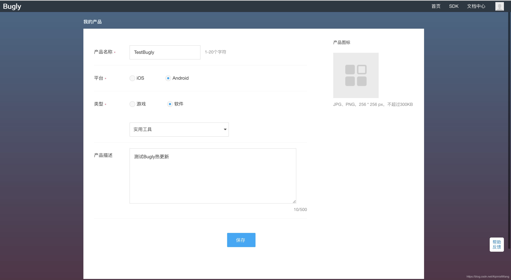

然后在我的产品–>设置中可以看到appId
 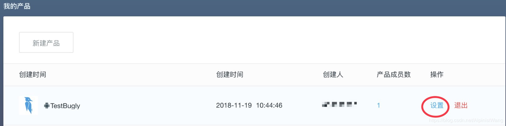
 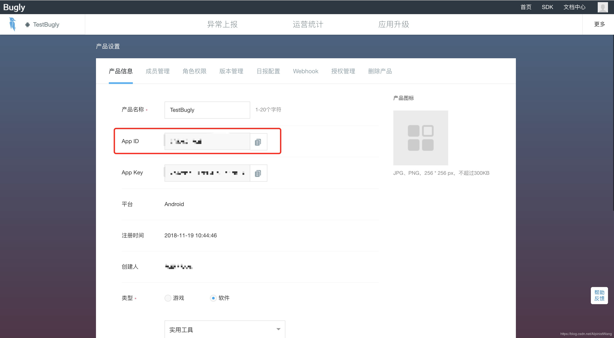
方式一：

新建TestThinkerApplication：
<pre><code>
class TestThinkerApplication : TinkerApplication(
    ShareConstants.TINKER_ENABLE_ALL, //tinkerFlags 表示Tinker支持的类型 dex only、library only or all suuport，default: TINKER_ENABLE_ALL
    "com.aifudao.testthinker.TestThinkerApplicationLike",//delegateClassName Application代理类 这里填写你自定义的ApplicationLike
    "com.tencent.tinker.loader.TinkerLoader",//loaderClassName Tinker的加载器，使用默认即可
    false //tinkerLoadVerifyFlag 加载dex或者lib是否验证md5，默认为false
)
</code></pre>
和ApplicationLike
<pre><code>
class TestThinkerApplicationLike(
    application: Application, tinkerFlags: Int,
    tinkerLoadVerifyFlag: Boolean, applicationStartElapsedTime: Long,
    applicationStartMillisTime: Long, tinkerResultIntent: Intent
) : DefaultApplicationLike(
    application,
    tinkerFlags,
    tinkerLoadVerifyFlag,
    applicationStartElapsedTime,
    applicationStartMillisTime,
    tinkerResultIntent
) {
 
 
    override fun onCreate() {
        super.onCreate()
        // 这里实现SDK初始化，appId替换成你的在Bugly平台申请的appId
        // 调试时，将第三个参数改为true
        Bugly.init(application, "73535fdec4", false)
    }
 
 
    @TargetApi(Build.VERSION_CODES.ICE_CREAM_SANDWICH)
    override fun onBaseContextAttached(base: Context) {
        super.onBaseContextAttached(base)
        // you must install multiDex whatever tinker is installed!
        MultiDex.install(base)
 
        // 安装tinker
        // TinkerManager.installTinker(this); 替换成下面Bugly提供的方法
        Beta.installTinker(this)
    }
 
    @TargetApi(Build.VERSION_CODES.ICE_CREAM_SANDWICH)
    fun registerActivityLifecycleCallback(callbacks: Application.ActivityLifecycleCallbacks) {
        application.registerActivityLifecycleCallbacks(callbacks)
    }
 
    companion object {
        val TAG = "Tinker.TestThinkerApplicationLike"
    }
 
}
</code></pre>
方式二：

新建BaseApplication：
<pre><code>
@Suppress("unused")
class BaseApplication : Application(), BetaPatchListener {
 
    override fun onCreate() {
        super.onCreate()
        /**Bugly管理平台：https://bugly.qq.com/v2/ */
        Bugly.init(this, Bugly管理平台申请的appId, false)
    }
 
    override fun attachBaseContext(base: Context) {
        super.attachBaseContext(base)
        MultiDex.install(base)
        /**安装tinker*/
        Beta.installTinker()
        /**设置监听器，补丁包应用成功后杀进程，重启app*/
        Beta.betaPatchListener = this
    }
 
    /**Bugly BetaPatchListener*/
    override fun onApplySuccess(p0: String?) {
        /**补丁包应用成功回调，在这里杀进程，重启app，完成热更新。
        否则需要等待用户下次自己主动杀进程重启后才能完成更新*/
        restartApp()
    }
 
    override fun onPatchReceived(p0: String?) {
    }
 
    override fun onApplyFailure(p0: String?) {
    }
 
    override fun onDownloadReceived(p0: Long, p1: Long) {
    }
 
    override fun onDownloadSuccess(p0: String?) {
    }
 
    override fun onDownloadFailure(p0: String?) {
    }
 
    override fun onPatchRollback() {
    }
 
    /**
     * 杀进程，重启app
     */
    private fun restartApp() {
        val intent = Intent(this, MainActivity::class.java)
        intent.addFlags(Intent.FLAG_ACTIVITY_NEW_TASK)
        startActivity(intent)
        android.os.Process.killProcess(android.os.Process.myPid())
    }
}
</code></pre>
## 五、AndroidManifest.xml配置
在AndroidMainfest.xml中进行以下配置：

权限配置
<pre><code>
<uses-permission android:name="android.permission.READ_PHONE_STATE" />
<uses-permission android:name="android.permission.INTERNET" />
<uses-permission android:name="android.permission.ACCESS_NETWORK_STATE" />
<uses-permission android:name="android.permission.ACCESS_WIFI_STATE" />
<uses-permission android:name="android.permission.READ_LOGS" />
<uses-permission android:name="android.permission.WRITE_EXTERNAL_STORAGE" />
</code></pre>
Activity配置
<pre><code>
<activity
    android:name="com.tencent.bugly.beta.ui.BetaActivity"
    android:configChanges="keyboardHidden|orientation|screenSize|locale"
    android:theme="@android:style/Theme.Translucent" />
    </code></pre>
配置FileProvider  
<pre><code>
//先在res目录新建xml文件夹，创建provider_paths.xml文件如下：
<?xml version="1.0" encoding="utf-8"?>
<paths>
    <external-path
        name="beta_external_path"
        path="Download/" />
    <external-path
        name="beta_external_files_path"
        path="Android/data/" />
</paths>
</code></pre>
在AndroidManifest中配置FileProvider：
<pre><code>
<provider
    android:name="android.support.v4.content.FileProvider"
    android:authorities="${applicationId}.fileProvider"
    android:exported="false"
    android:grantUriPermissions="true">
    <meta-data
        android:name="android.support.FILE_PROVIDER_PATHS"
        android:resource="@xml/provider_paths"/>
</provider>
</code></pre>
## 六、混淆配置：
<pre><code>
# bugly混淆规则
-dontwarn com.tencent.bugly.**
-keep public class com.tencent.bugly.**{*;}
# tinker混淆规则
-dontwarn com.tencent.tinker.**
-keep class com.tencent.tinker.** { *; }
# v4包混淆规则
-keep class android.support.**{*;}
</code></pre>
## 七、生成基准包
我在主页中设置一个跳转新页面。然后在新页面里制造一个crash
<pre><code>
class CrashActivity : AppCompatActivity() {
 
    override fun onCreate(savedInstanceState: Bundle?) {
        super.onCreate(savedInstanceState)
        setContentView(R.layout.activity_crash)
        crashBtn.setOnClickListener {
            100/0
        }
    }
}
</code></pre>
运行成功后，在Bugly管理后台的我的产品–>版本管理界面可以看到如下显示

 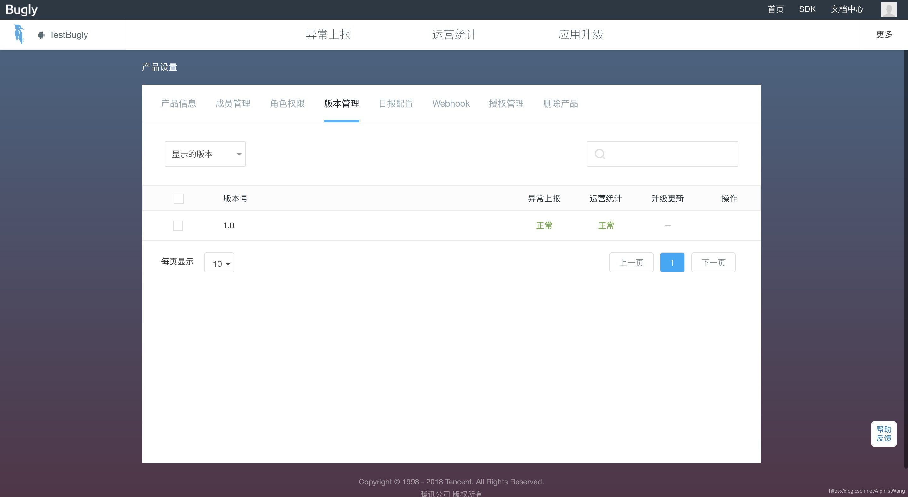

生成基准包：

 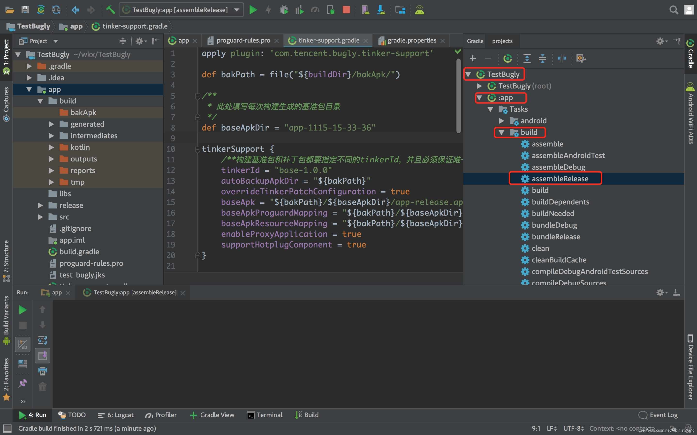

或者运行命令：

 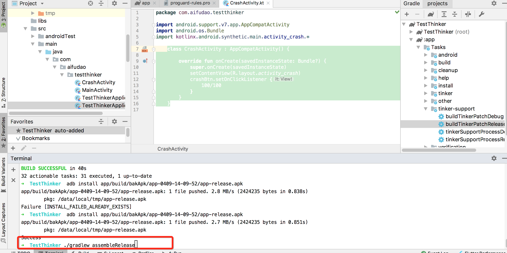

点击图示位置的assembleRelease，生成基准包，完成后在下图位置可以看到app_release.apk

 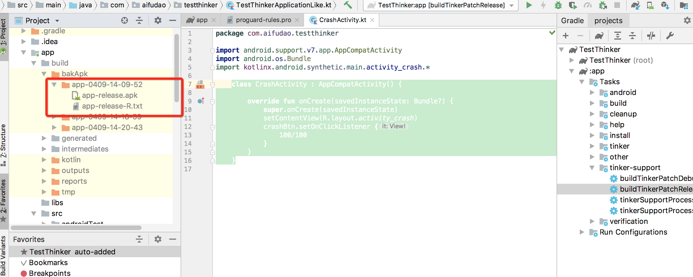

在手机联网状态下，安装此基准包，否则上传补丁包时会报错：“未匹配到可应用补丁包的App版本，请确认补丁包的基线版本是否配置正确”

## 八、生成补丁包
修改CrashActivity中的代码：
<pre><code>
class CrashActivity : AppCompatActivity() {
 
    override fun onCreate(savedInstanceState: Bundle?) {
        super.onCreate(savedInstanceState)
        setContentView(R.layout.activity_crash)
        crashBtn.setOnClickListener {
            100/100
        }
    }
}
</code></pre>
生成补丁包：
1.先将tinker-support.gradle中的baseApkDir修改为第七步生成的apk文件夹名
 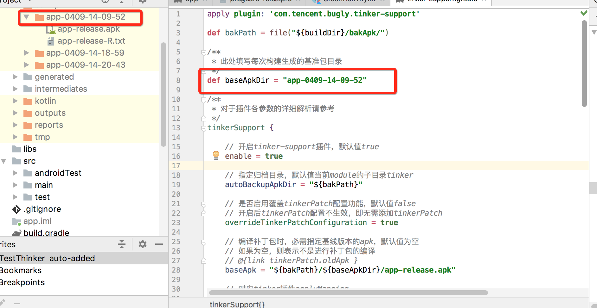

2.再将tinkerId修改为base-path-1.2

 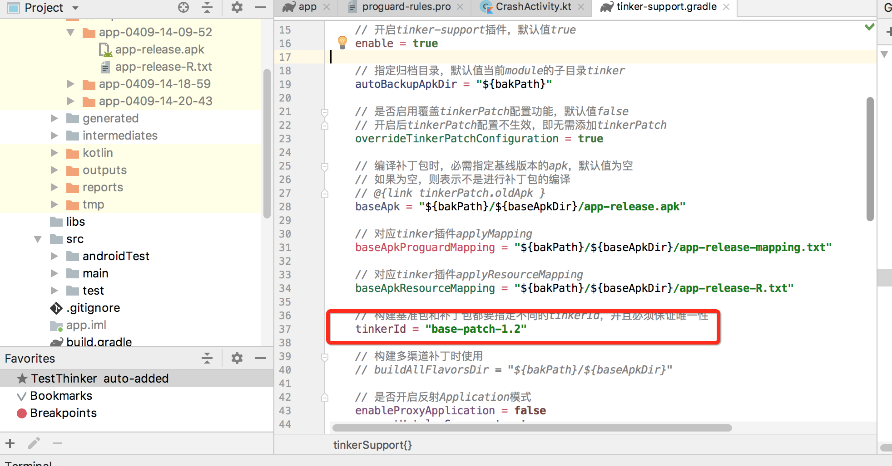

3.然后点击下图位置的buildTinkerPatchRelease生成补丁包

 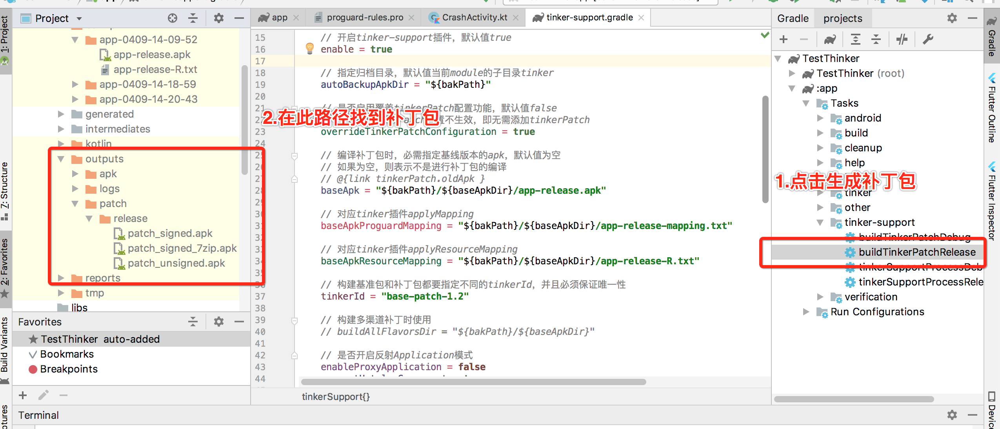

这里注意路径不要找错了，是patch/release文件夹下的patch_signed_7zip.apk，而不是apk/tinkerPatch/release文件夹下的patch_signed_7zip.apk，如果上传apk文件夹下的补丁包，Bugly管理平台会报错：“上传失败！补丁文件缺失必需字段：Created-Time、Created-By、YaPatchType、VersionName、VersionCode、From、To，请检查补丁文件后重试！”

## 九、上传补丁包，见证热更新
在Bugly管理后台的 应用升级 --> 热更新 中，点击发布新补丁：
 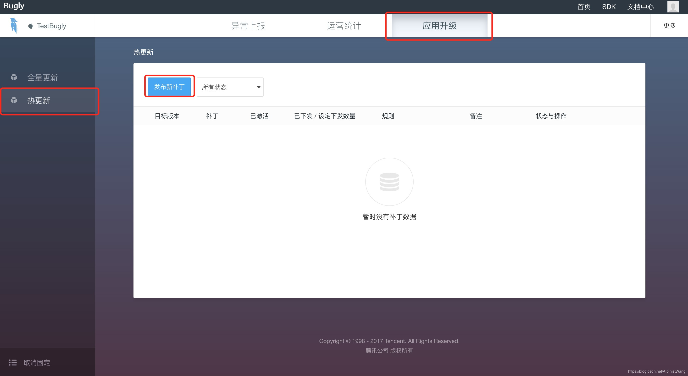

上传patch/release文件夹下的patch_signed_7zip.apk：设置更新范围

 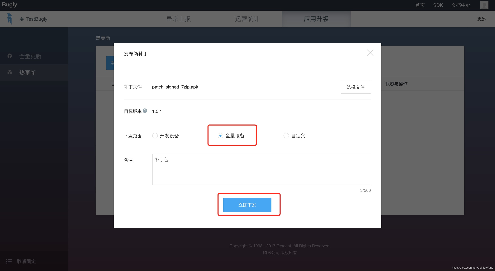

上传成功后，显示如下：

 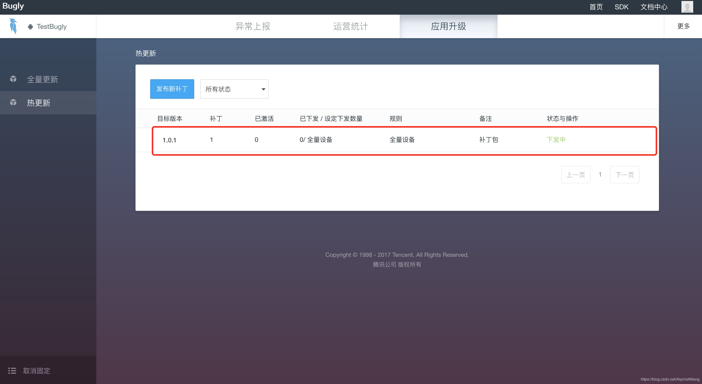

然后等待热更新生效，生效时间大概十分钟
 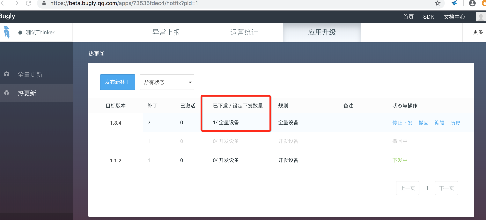

更多细节请参考官方文档：

https://bugly.qq.com/docs/user-guide/instruction-manual-android-hotfix-demo/?v=20181014122344

https://bugly.qq.com/docs/user-guide/instruction-manual-android-hotfix/?v=20181014122344

常见问题：https://bugly.qq.com/docs/user-guide/faq-android-hotfix/?v=20181014122344
